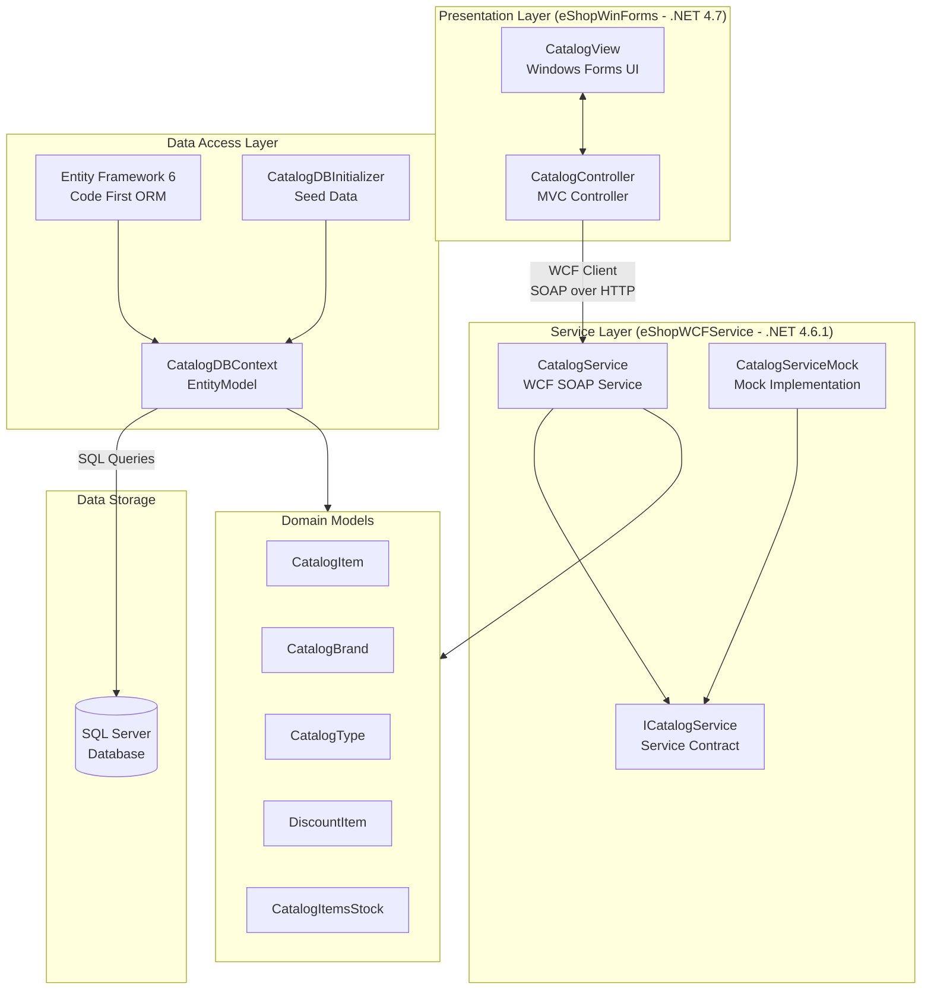

# eShopLegacyNTier Architecture Diagram

## Overview

eShopLegacyNTier is a classic N-Tier .NET application consisting of a Windows Forms desktop client and a WCF SOAP backend service, backed by a SQL Server database via Entity Framework.

## Architecture Diagram

## Technology Stack

| Layer | Technology |
|-------|-----------|
| Presentation | Windows Forms (.NET 4.7) |
| Service | WCF SOAP Web Service (.NET 4.6.1, IIS) |
| Data Access | Entity Framework 6.1.3 (Code First) |
| Database | SQL Server |
| Serialization | Newtonsoft.Json 6.0.4 |
| Service Communication | WCF / SOAP (System.ServiceModel) |

## Key Components

- **eShopWinForms**: Desktop application using MVC pattern (CatalogView + CatalogController) that communicates with the backend via a WCF service reference proxy.
- **eShopWCFService**: WCF SOAP service hosted on IIS exposing `ICatalogService` contract with operations for catalog management (items, brands, types, discounts, stock).
- **EntityModel**: Entity Framework 6 DbContext managing persistence for all catalog domain models against SQL Server.
- **CatalogDBInitializer**: Seeds the database with preconfigured catalog data on first run.
