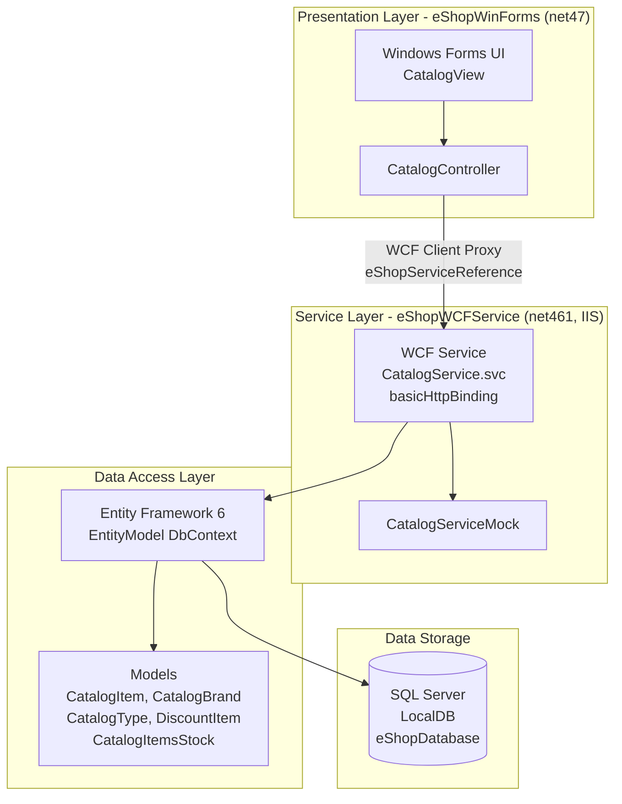

# eShopLegacyNTier - Architecture Diagram

## Overview

This is a legacy N-Tier .NET application consisting of a Windows Forms client and a WCF backend service communicating over HTTP, backed by a SQL Server database via Entity Framework.

## Architecture Diagram

## Technology Stack

| Component | Technology |
|-----------|-----------|
| Client UI | Windows Forms (.NET 4.7) |
| Service Layer | WCF Service (.NET 4.6.1, hosted on IIS) |
| Service Binding | basicHttpBinding |
| Data Access | Entity Framework 6.1.3 |
| Database | SQL Server (LocalDB - MSSQLLocalDB) |
| Serialization | Newtonsoft.Json 6.0.4 |
| HTTP Client | System.Net.Http / ASP.NET WebAPI Client |

## Key Migration Considerations

- **WCF**: Not supported in .NET Core / .NET 5+; requires migration to gRPC or REST/HTTP APIs
- **Windows Forms**: Limited cross-platform support; requires Windows environment
- **Entity Framework 6**: Can be migrated to EF Core with minor changes
- **SQL Server LocalDB**: Should be replaced with a proper SQL Server or Azure SQL Database for production
- **Target Framework**: Both projects target legacy .NET Framework (4.6.1 / 4.7); migration to .NET 8+ recommended
