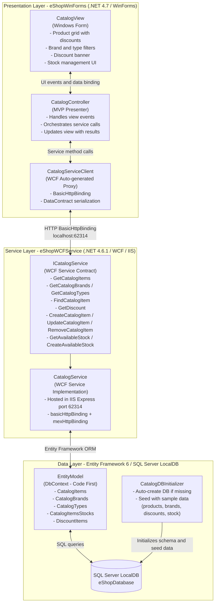

# Architecture Diagram

This diagram represents the high-level architecture of the eShopLegacyNTier application, a classic N-Tier Windows desktop e-commerce catalog system built on .NET Framework.

## Application Architecture

