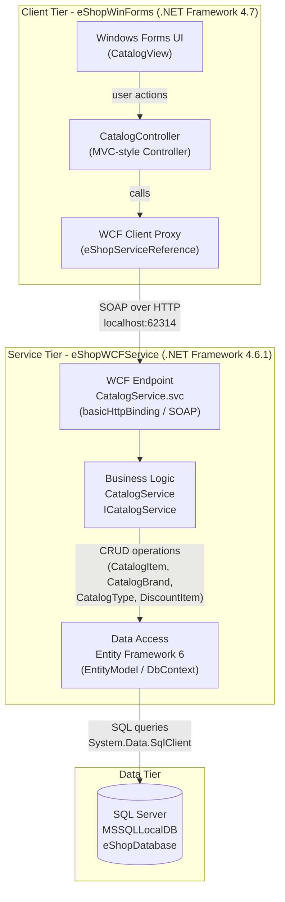

# Architecture Diagram

This diagram represents the current architecture of the eShopLegacyNTier application, a .NET Framework N-Tier solution composed of a Windows Forms client and a WCF backend service.

## Application Architecture

