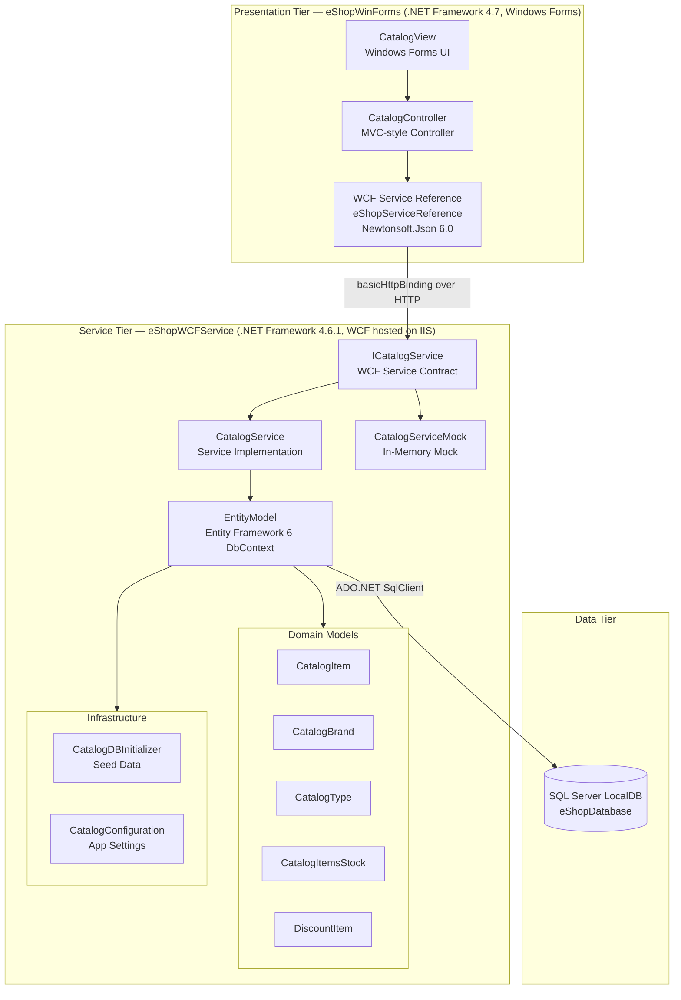

# Architecture Diagram

This diagram illustrates the N-Tier architecture of the eShopLegacyNTier application, consisting of a Windows Forms desktop client, a WCF back-end service, and a SQL Server database.

## Application Architecture

