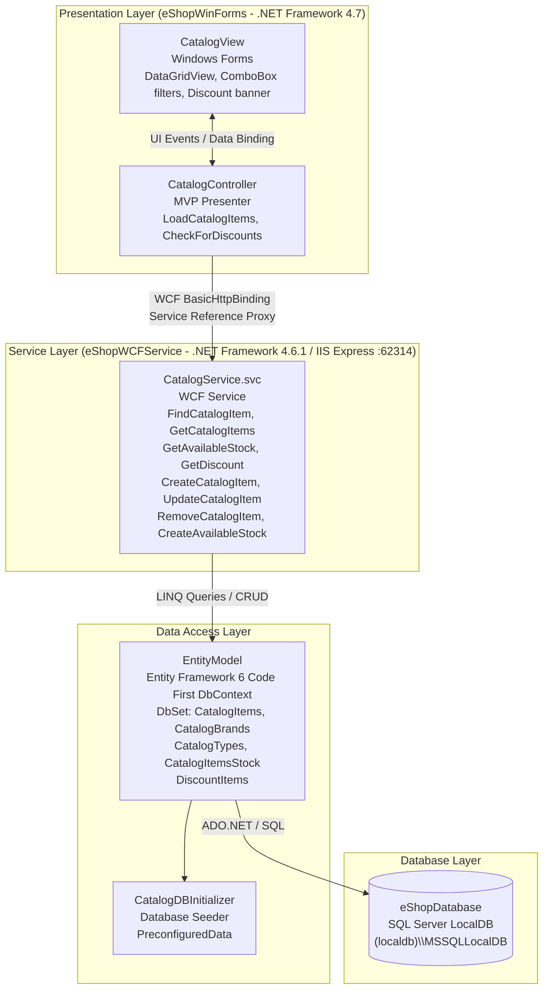

# Architecture Diagram

eShopLegacyNTier is a legacy .NET N-Tier application consisting of a Windows Forms desktop client communicating with a WCF service backend backed by SQL Server via Entity Framework 6.

## Application Architecture

