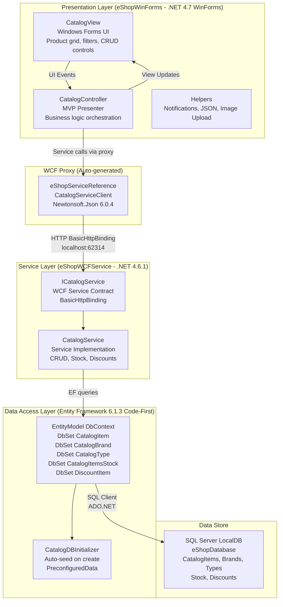

# Architecture Diagram

This diagram illustrates the N-Tier architecture of the eShopLegacyNTier application, a Windows desktop catalog management system built on .NET Framework with a WCF service backend and SQL Server database.

## Application Architecture

