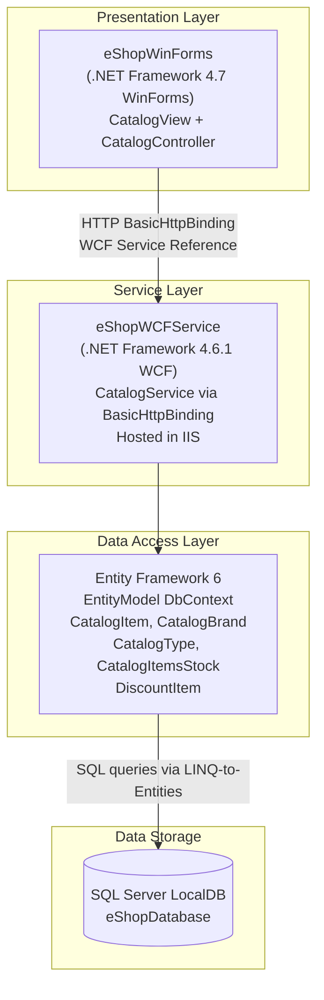

# Architecture Diagram

eShopLegacyNTier is a legacy .NET Framework N-Tier desktop application for managing a product catalog, consisting of a Windows Forms client and a WCF service backed by SQL Server.

## Application Architecture

