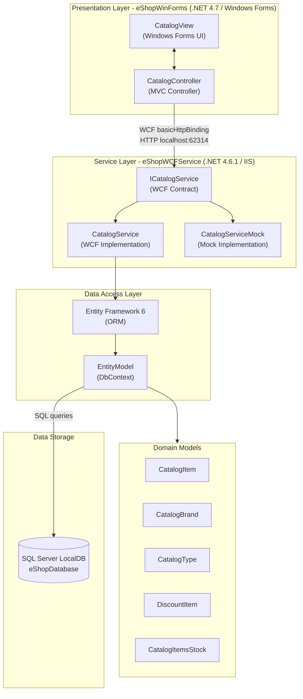

# Architecture Diagram

This diagram represents the N-Tier architecture of the eShop application, consisting of a Windows Forms desktop client and a WCF backend service backed by SQL Server.

## Application Architecture

