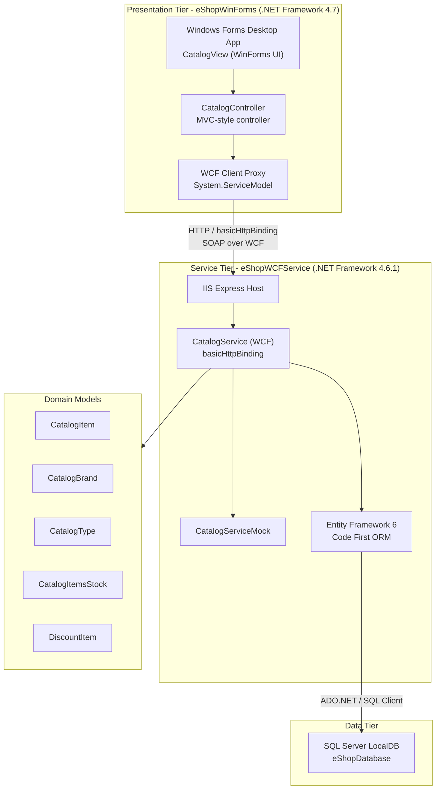

# Architecture Diagram

This is a legacy .NET N-Tier application consisting of a Windows Forms desktop client communicating with a WCF service backed by a SQL Server database.

## Application Architecture

