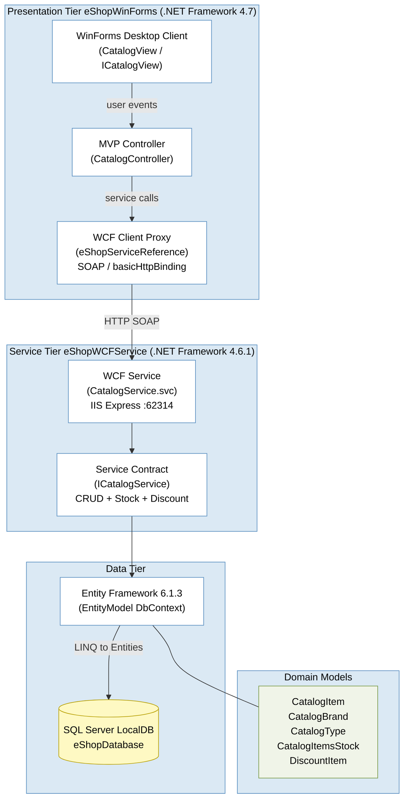

# Architecture Diagram

This diagram shows the high-level architecture of the eShopLegacyNTier application  a legacy N-Tier catalog management system built on .NET Framework.

## Application Architecture

