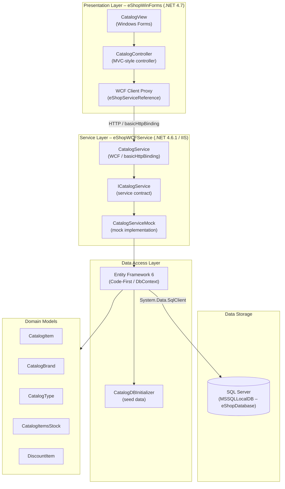

# Architecture Diagram

This diagram shows the current architecture of the eShopLegacyNTier application, a two-tier .NET desktop solution composed of a WinForms client and a WCF back-end service backed by SQL Server.

## Application Architecture

