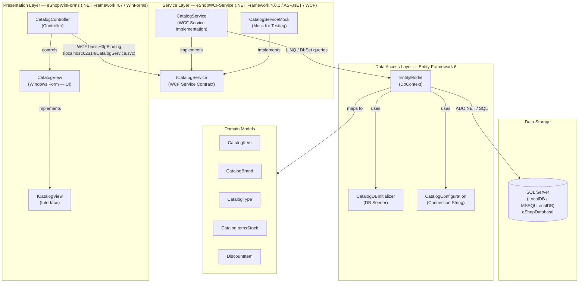

# eShopLegacyNTier Architecture Diagram

## Overview

**eShopLegacyNTier** is a classic N-Tier .NET Framework application consisting of a Windows Forms desktop client, a WCF (Windows Communication Foundation) back-end service, and a SQL Server database accessed via Entity Framework 6.

---

## Architecture Diagram

---

## Technology Stack

| Layer | Technology |
|---|---|
| Desktop Client | Windows Forms (.NET Framework 4.7) |
| Service Communication | WCF (basicHttpBinding over HTTP) |
| Back-end Service Host | ASP.NET (.NET Framework 4.6.1) |
| ORM / Data Access | Entity Framework 6.1.3 |
| Database | SQL Server (LocalDB — MSSQLLocalDB) |
| Serialization (client) | Newtonsoft.Json 6.0.4 |
| HTTP Client (client) | Microsoft.AspNet.WebApi.Client 5.2.3 |

---

## Key Observations (from AppCAT Assessment)

- **4 issues** and **5 incidents** detected totalling **15 story points**
- All findings are **Optional** (4) or **Potential** (1) — no mandatory blockers
- The application uses legacy technologies (WCF, WinForms, .NET Framework) that are candidates for modernization to .NET / Azure
- SQL Server LocalDB is used for local development; a managed Azure SQL Database would be required for cloud deployment
