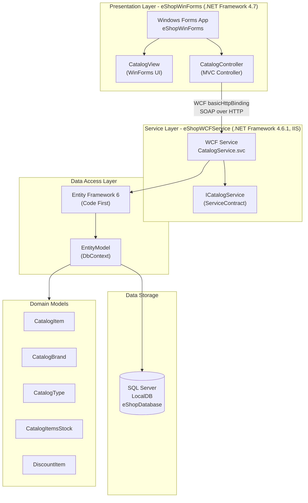

# eShopLegacyNTier - Architecture Diagram

## Architecture Summary

| Layer | Component | Technology |
|-------|-----------|-----------|
| Presentation | eShopWinForms | .NET Framework 4.7, Windows Forms |
| Service | eShopWCFService | .NET Framework 4.6.1, WCF, IIS |
| Data Access | EntityModel | Entity Framework 6 (Code First) |
| Data Storage | eShopDatabase | SQL Server LocalDB |

## Key Dependencies

- **Communication**: WCF basicHttpBinding (SOAP over HTTP, port 62314)
- **ORM**: Entity Framework 6.1.3 with SQL Server provider
- **Serialization**: Newtonsoft.Json 6.0.4
- **HTTP Client**: Microsoft.AspNet.WebApi.Client 5.2.3

## Assessment Findings

- **Total Issues**: 5 (0 mandatory, 6 optional, 1 potential)
- **Total Story Points**: 21
- **Issue Categories**: Runtime (2), Database (2), Security (2), Scale (1)
- **Target Platforms**: Azure App Service, Azure Kubernetes Service, Azure Container Apps

### Per-Project Summary

| Project | Issues | Story Points | Framework | Language |
|---------|--------|-------------|-----------|----------|
| eShopWCFService | 4 | 15 | .NET Framework 4.6.1 | C# |
| eShopWinForms | 2 | 6 | .NET Framework 4.7 | C# |
