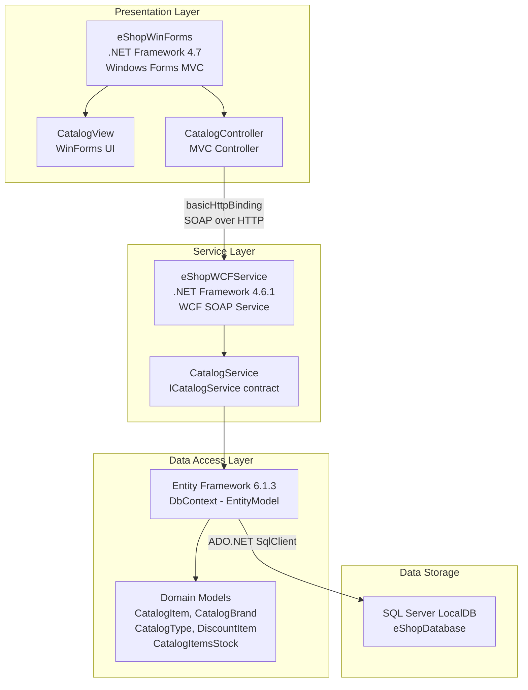

# eShopLegacyNTier Architecture Diagram

## Application Architecture

## Technology Stack

| Layer | Technology |
|-------|-----------|
| Presentation | .NET Framework 4.7, Windows Forms |
| Service | .NET Framework 4.6.1, WCF (System.ServiceModel) |
| Data Access | Entity Framework 6.1.3 |
| Database | SQL Server (LocalDB - mssqllocaldb) |
| Serialization | Newtonsoft.Json 6.0.4 |
| HTTP Client | Microsoft.AspNet.WebApi.Client 5.2.3 |

## Key Observations

- **N-Tier Architecture**: Classic 3-tier design with Presentation, Service, and Data layers
- **WCF Communication**: WinForms client communicates with backend via SOAP/basicHttpBinding
- **ORM**: Entity Framework 6 (Code First with DB initializer) manages data persistence
- **Windows-only**: WinForms and WCF with localdb are Windows-platform-specific technologies
- **Static Assets**: Application contains 98 static asset files (images, fonts) stored in the repo
