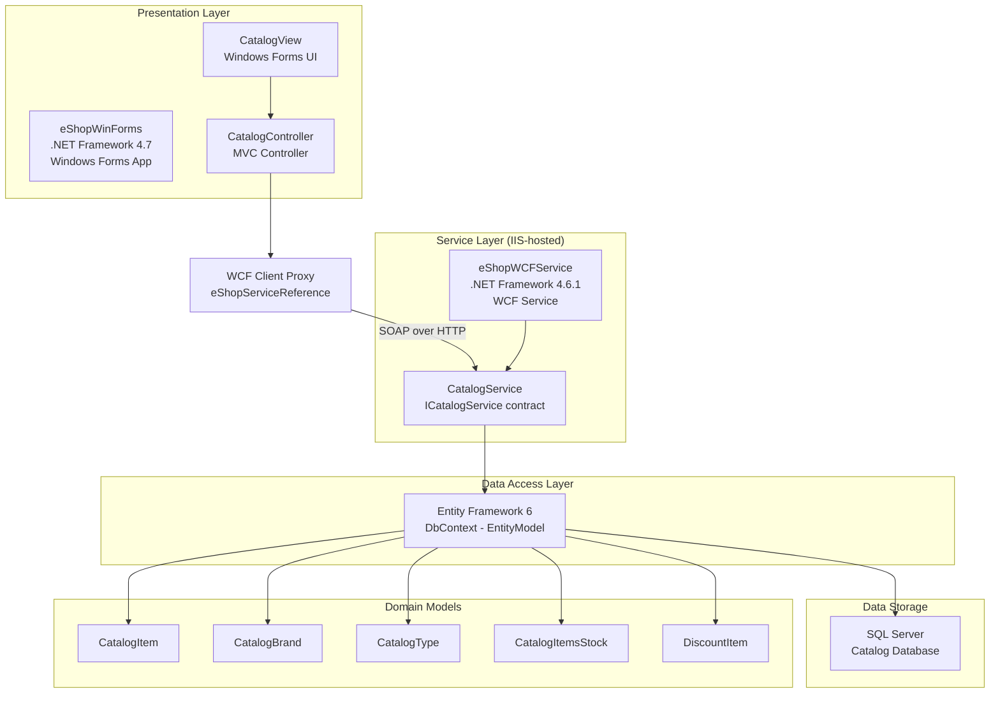

# eShopLegacyNTier Architecture Diagram

## Architecture Overview

| Layer | Technology | Description |
|-------|-----------|-------------|
| Presentation | Windows Forms (.NET 4.7) | Desktop GUI app (`eShopWinForms`) with MVC pattern |
| Service | WCF (.NET 4.6.1, IIS) | `eShopWCFService` exposes `ICatalogService` via SOAP |
| Data Access | Entity Framework 6 | `EntityModel` DbContext with code-first migrations |
| Data Storage | SQL Server | Relational database for catalog and stock data |

## Key Dependencies

- **EntityFramework 6.1.3** – ORM for SQL Server data access
- **System.ServiceModel (WCF)** – Service communication between WinForms and WCF
- **Newtonsoft.Json 6.0.4** – JSON serialization in the WinForms client
- **Microsoft.AspNet.WebApi.Client 5.2.3** – HTTP client utilities in WinForms
