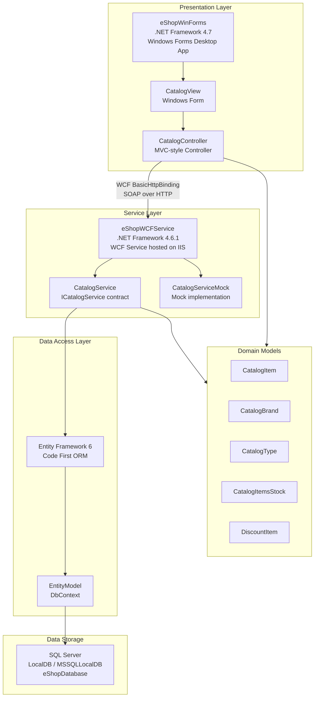

# eShopLegacyNTier Architecture Diagram

## Application Overview

**eShopLegacyNTier** is a classic N-Tier .NET application consisting of two projects:
- **eShopWCFService** (.NET Framework 4.6.1) — WCF-based backend service exposing a catalog API via SOAP/HTTP
- **eShopWinForms** (.NET Framework 4.7) — Windows Forms desktop client consuming the WCF service

## Architecture Diagram

## Technology Stack

| Component | Technology |
|-----------|-----------|
| Desktop Client | Windows Forms (.NET Framework 4.7) |
| Service | WCF (Windows Communication Foundation) |
| Service Host | IIS / IIS Express |
| Service Binding | BasicHttpBinding (SOAP over HTTP) |
| ORM | Entity Framework 6.1.3 |
| Database | SQL Server (LocalDB) |
| Serialization | System.Runtime.Serialization, Newtonsoft.Json |
| HTTP Client | System.Net.Http, ASP.NET WebAPI Client |

## Key Components

- **ICatalogService**: WCF service contract exposing catalog operations (CRUD for items, brands, types, stock, discounts)
- **CatalogService**: Live implementation using Entity Framework to access SQL Server
- **CatalogServiceMock**: In-memory mock for testing/development
- **EntityModel**: EF6 DbContext managing the database schema
- **CatalogController**: Client-side controller handling UI logic and WCF service calls
- **CatalogView**: Windows Forms UI presenting catalog data

## Assessment Summary

- **Issues Found**: 8
- **Incidents**: 54
- **Story Points**: 70
- **Target**: Any (cloud migration readiness)
- **Framework**: .NET Framework 4.6.1 / 4.7 — migration to .NET 8+ recommended
