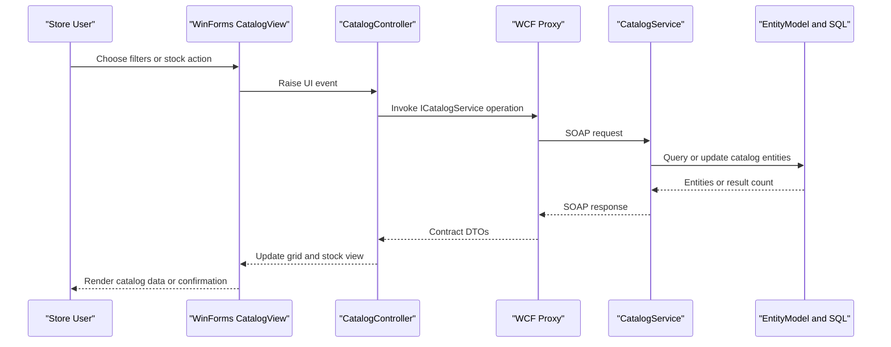

# API & Service Communication Contracts

This document captures the service contract surface and request/response communication used by the WinForms client and WCF catalog service.

## Service Catalog

| Service | Port | Category | Purpose |
|---|---:|---|---|
| eShopWinForms | N/A | API Layer | Desktop client that triggers catalog and stock operations |
| eShopWCFService (CatalogService.svc) | 62314 | Business | Exposes catalog, stock, and discount operations via SOAP |

## API Endpoints Inventory

| Service | Method | Path | Request Type | Response Type |
|---|---|---|---|---|
| eShopWCFService | SOAP Operation | /CatalogService.svc/FindCatalogItem | id:int | CatalogItem |
| eShopWCFService | SOAP Operation | /CatalogService.svc/GetCatalogItems | brandIdFilter:int, typeIdFilter:int | List CatalogItem |
| eShopWCFService | SOAP Operation | /CatalogService.svc/GetCatalogBrands | none | List CatalogBrand |
| eShopWCFService | SOAP Operation | /CatalogService.svc/GetCatalogTypes | none | List CatalogType |
| eShopWCFService | SOAP Operation | /CatalogService.svc/GetAvailableStock | date:DateTime, catalogItemId:int | int |
| eShopWCFService | SOAP Operation | /CatalogService.svc/CreateAvailableStock | CatalogItemsStock | void |
| eShopWCFService | SOAP Operation | /CatalogService.svc/CreateCatalogItem | CatalogItem | void |
| eShopWCFService | SOAP Operation | /CatalogService.svc/UpdateCatalogItem | CatalogItem | void |
| eShopWCFService | SOAP Operation | /CatalogService.svc/RemoveCatalogItem | CatalogItem | void |
| eShopWCFService | SOAP Operation | /CatalogService.svc/GetDiscount | day:DateTime | DiscountItem |

## Management & Observability Endpoints

| Service | Endpoint | Custom Metrics (if any) |
|---|---|---|
| eShopWCFService | /CatalogService.svc?wsdl and /CatalogService.svc/mex metadata endpoint | None detected |
| eShopWinForms | None | None detected |

## DTOs & Contracts

The WCF contract uses `CatalogItem`, `CatalogBrand`, `CatalogType`, `CatalogItemsStock`, and `DiscountItem` as service-level contract DTOs. `ICatalogService` defines request and response signatures for all client-service interactions. DTOs are mutable C# classes annotated with `DataContract` and `DataMember`; no immutable record-based contract model is present.

## Communication Patterns

Communication is synchronous and point-to-point: the WinForms client calls the WCF service through generated service reference proxies over `basicHttpBinding`. No asynchronous messaging, queue-based patterns, retries, or circuit-breaker library usage is configured. Service discovery is static via endpoint URL in `App.config`. Security posture is minimal in current configuration: endpoint is HTTP and no explicit authentication/authorization controls are declared in service configuration.

## Service Technology Matrix

| Service | Web | Data Access | Discovery | Gateway | Actuator | Cache | Metrics |
|---|---|---|---|---|---|---|---|
| eShopWinForms | WinForms desktop | N/A | Static endpoint URL | No | No | No | No |
| eShopWCFService | WCF SOAP | EF6 DbContext | None | No | No | No | No |

## Service Communication Sequence

