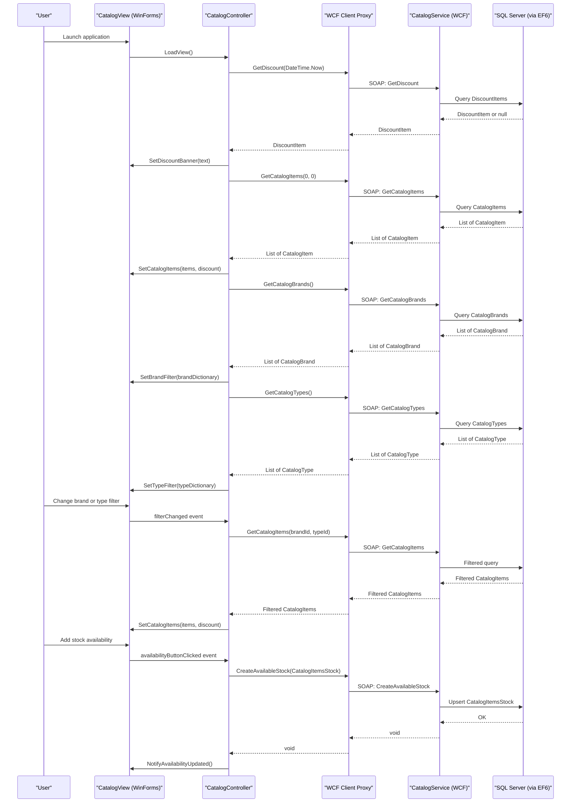

# API & Service Communication Contracts

This application exposes a single WCF (SOAP) service contract (`ICatalogService`) with 10 operations, consumed by a Windows Forms desktop client via an auto-generated WCF proxy. There are no REST/HTTP endpoints, API gateways, or asynchronous messaging channels.

## Service Catalog

| Service | Port | Category | Purpose |
|---|---|---|---|
| eShopWCFService | 62314 (IIS Express) | Business | WCF SOAP service exposing catalog and stock management operations |
| eShopWinForms | N/A (desktop) | API Layer | Windows Forms client consuming the WCF service via generated proxy |

## API Endpoints Inventory

The application uses WCF (SOAP) rather than REST HTTP endpoints. All operations are defined on the `ICatalogService` service contract.

| Service | Operation | Input Parameters | Return Type | Description |
|---|---|---|---|---|
| CatalogService | FindCatalogItem | id: int | CatalogItem | Retrieves a single catalog item by ID |
| CatalogService | GetCatalogBrands | (none) | List&lt;CatalogBrand&gt; | Returns all catalog brands |
| CatalogService | GetCatalogItems | brandIdFilter: int, typeIdFilter: int | List&lt;CatalogItem&gt; | Returns catalog items filtered by brand and/or type |
| CatalogService | GetCatalogTypes | (none) | List&lt;CatalogType&gt; | Returns all catalog types/categories |
| CatalogService | GetAvailableStock | date: DateTime, catalogItemId: int | int | Returns available stock count for an item on a given date |
| CatalogService | CreateAvailableStock | catalogItemsStock: CatalogItemsStock | void | Creates or updates stock availability record for a date |
| CatalogService | CreateCatalogItem | catalogItem: CatalogItem | void | Adds a new catalog item |
| CatalogService | UpdateCatalogItem | catalogItem: CatalogItem | void | Updates an existing catalog item |
| CatalogService | RemoveCatalogItem | catalogItem: CatalogItem | void | Removes a catalog item |
| CatalogService | GetDiscount | day: DateTime | DiscountItem | Returns the active discount for a given date (if any) |

## Management & Observability Endpoints

| Service | Endpoint | Custom Metrics |
|---|---|---|
| eShopWCFService | (none) | None |
| eShopWinForms | (none) | None |

No health check, metrics, or observability endpoints are configured in either project. There is no Swagger/OpenAPI documentation, no actuator-style endpoints, and no custom metric instrumentation.

## DTOs & Contracts

All service-level data contracts are defined in the `eShopWCFService` project using `[DataContract]` / `[DataMember]` WCF serialization attributes. The same classes are serialized over the wire and mapped to auto-generated proxy types on the client side:

| Class | Role | Immutability | Notes |
|---|---|---|---|
| CatalogItem | Service request and response body | Mutable | Core domain entity with brand and type navigation properties |
| CatalogBrand | Response type | Mutable | Lookup entity for brand filter values |
| CatalogType | Response type | Mutable | Lookup entity for type/category filter values |
| CatalogItemsStock | Request and response type | Mutable | Stock record tied to a catalog item and date |
| DiscountItem | Response type | Mutable | Time-bounded discount record |

There are no gateway-level aggregation DTOs, protobuf schemas, GraphQL schemas, or OpenAPI specifications. Serialization is handled entirely by the WCF DataContractSerializer. For full field definitions and persistence details, see `data-architecture.md`.

## Communication Patterns

**Synchronous (SOAP/WCF):** The sole communication pattern is synchronous SOAP over HTTP between `eShopWinForms` and `eShopWCFService`. The WinForms client uses an auto-generated WCF proxy (`eShopServiceReference`) which wraps each call as a blocking synchronous invocation.

**No asynchronous messaging:** There are no message queues, event-driven patterns, or pub/sub mechanisms.

**No resilience patterns:** There are no circuit breakers, retry policies, timeout configurations, or bulkhead patterns implemented. If the WCF service is unavailable, the client will throw an unhandled exception.

**No service discovery:** The service endpoint URL is hardcoded in the WinForms application configuration (`App.config`), pointing to the IIS Express localhost address (`http://localhost:62314/`). There is no dynamic service registry.

**No API gateway:** The client connects directly to the WCF service. There is no intermediary gateway, BFF, or reverse proxy layer.

**Security posture:** No transport security (TLS/HTTPS), message-level security, authentication (tokens, credentials, Windows Auth), or authorization checks are configured at the API contract level. All service operations are publicly accessible to any client that can reach the endpoint URL. There is no role-based access control or claim-based authorization.

## Service Technology Matrix

| Service | Web Framework | Data Access | Discovery | Gateway | Health Check | Cache | Metrics |
|---|---|---|---|---|---|---|---|
| eShopWCFService | WCF / System.ServiceModel | Entity Framework 6 | None (static URL) | None | None | None | None |
| eShopWinForms | Windows Forms | WCF Proxy | None (static URL) | None | None | None | None |

## Service Communication Sequence

