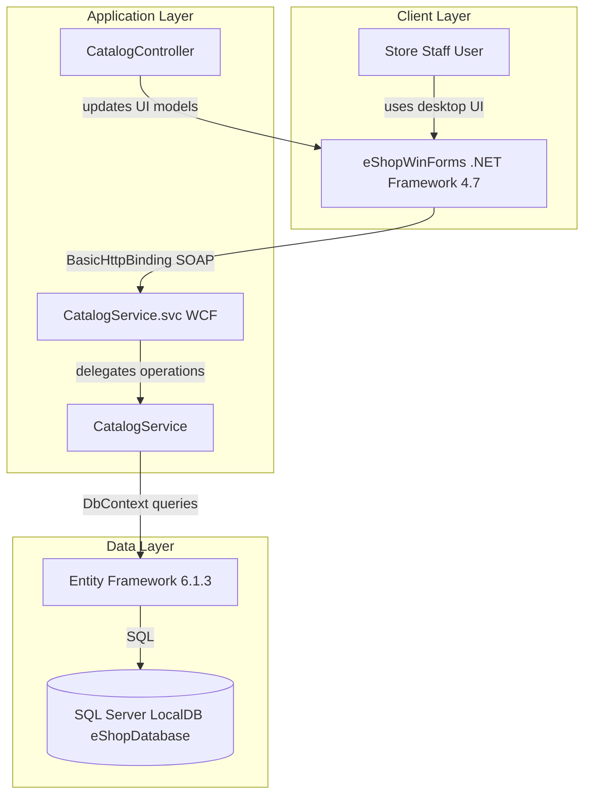
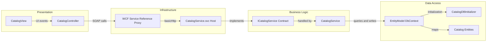

# Architecture Diagram

This document summarizes the current eShopLegacyNTier architecture and key runtime component relationships.

## Application Architecture

### Technology Stack Summary

| Layer | Technology | Version | Purpose |
|---|---|---|---|
| Presentation | Windows Forms | .NET Framework 4.7 | Desktop UI for catalog browsing and stock management |
| Service | WCF Service (basicHttpBinding) | .NET Framework 4.6.1 | Exposes catalog and stock operations |
| Data Access | Entity Framework | 6.1.3 | ORM for catalog entities and persistence |
| Database | SQL Server LocalDB | LocalDB | Stores catalog items, stock, discounts, brands, and types |

### Data Storage & External Services

The solution persists data in a SQL Server LocalDB database (`eShopDatabase`) through Entity Framework. The WinForms client consumes the internal WCF endpoint over Basic HTTP at `http://localhost:62314/CatalogService.svc`; no third-party external APIs are configured.

### Key Architectural Decisions

- Uses a split client-service architecture: WinForms UI and separate WCF backend.
- Uses Entity Framework Code First with a database initializer to seed catalog data.
- Uses a service-reference proxy in the client instead of direct database access.

## Component Relationships

### Component Inventory

| Component | Layer | Type | Responsibility |
|---|---|---|---|
| CatalogView | Presentation | WinForms Form | Displays catalog, filters, and stock operations |
| CatalogController | Presentation | Controller | Coordinates UI events with service operations |
| ICatalogService | Business Logic | WCF Service Contract | Defines catalog and stock operation signatures |
| CatalogService | Business Logic | Service Implementation | Executes catalog queries, updates, and discount checks |
| EntityModel | Data Access | EF DbContext | Manages entity sets and persistence |
| CatalogDBInitializer | Data Access | EF Initializer | Seeds initial catalog brands, types, items, stock, discounts |
| CatalogService.svc | Infrastructure | WCF Host Endpoint | Exposes ICatalogService operations |
| Service Reference Proxy | Infrastructure | Client Proxy | Generated WinForms SOAP client for service communication |
