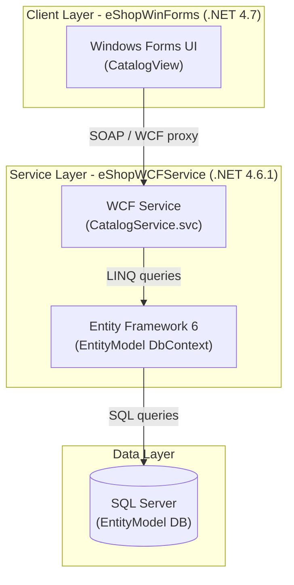
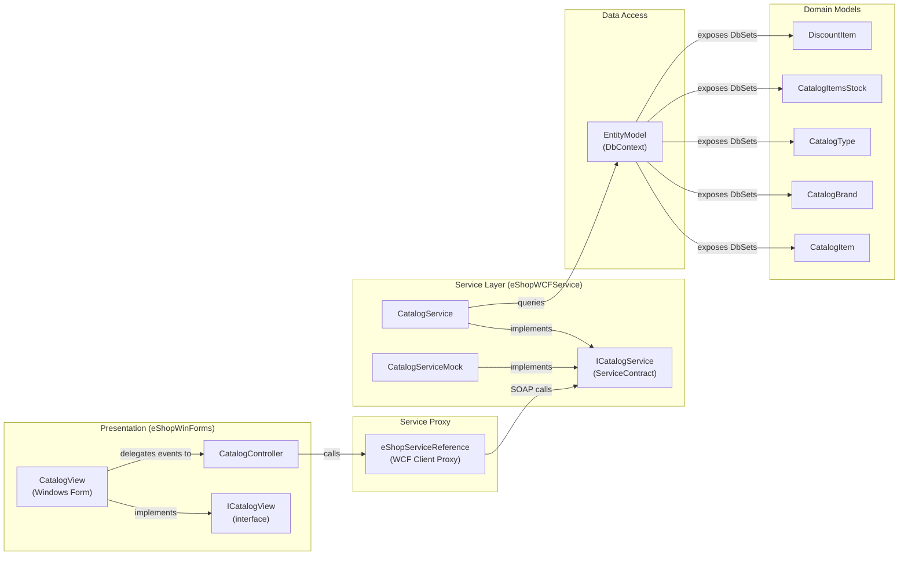

# Architecture Diagram

This document describes the architecture of eShopLegacyNTier, a legacy .NET application composed of a Windows Forms desktop client and a WCF backend service communicating over SOAP.

## Application Architecture

### Technology Stack Summary

| Layer | Technology | Version | Purpose |
|---|---|---|---|
| Presentation | Windows Forms | .NET 4.7 | Desktop UI for catalog management |
| Service Communication | WCF (SOAP) | .NET 4.6.1 | Exposes catalog operations as a service |
| Data Access | Entity Framework | 6.1.3 | ORM for SQL Server data access |
| Serialization | Newtonsoft.Json | 6.0.4 | JSON serialization in the WinForms client |
| HTTP Client | ASP.NET WebApi Client | 5.2.3 | HTTP utilities in the WinForms client |

### Data Storage & External Services

The application uses a single SQL Server database accessed via Entity Framework 6 Code-First with a database initializer (`CatalogDBInitializer`) that seeds preconfigured data. The connection string is read from the `EntityModel` named connection string in configuration or overridden via the `ConnectionString` environment variable. There are no external cloud services, caches, or message brokers.

### Key Architectural Decisions

- **N-Tier with WCF**: The client and backend are decoupled via a WCF SOAP service contract (`ICatalogService`), allowing the service to be hosted independently on IIS.
- **Repository-free direct DbContext**: `CatalogService` directly instantiates and uses `EntityModel` (DbContext) for all data operations — no repository layer is used.
- **MVP pattern in WinForms**: The desktop client follows a Model-View-Presenter pattern: `CatalogView` (view), `CatalogController` (presenter), and the WCF service reference (model/service).

## Component Relationships

### Component Inventory

| Component | Layer | Type | Responsibility |
|---|---|---|---|
| CatalogView | Presentation | Windows Form | Displays catalog items, brand/type filters, stock management UI |
| ICatalogView | Presentation | Interface | Contract between view and controller (MVP pattern) |
| CatalogController | Presentation | Controller/Presenter | Handles UI events, calls service, updates view |
| eShopServiceReference | Service Proxy | WCF Client Proxy | Auto-generated SOAP client proxy for ICatalogService |
| ICatalogService | Service Layer | WCF ServiceContract | Defines catalog service operations |
| CatalogService | Service Layer | WCF Service Implementation | Implements catalog CRUD and stock operations using EF |
| CatalogServiceMock | Service Layer | Mock Implementation | In-memory mock of ICatalogService for testing |
| EntityModel | Data Access | EF DbContext | ORM context mapping domain entities to SQL Server tables |
| CatalogItem | Domain Model | EF Entity | Represents a product in the catalog |
| CatalogBrand | Domain Model | EF Entity | Represents a product brand |
| CatalogType | Domain Model | EF Entity | Represents a product category/type |
| CatalogItemsStock | Domain Model | EF Entity | Represents available stock for a catalog item on a date |
| DiscountItem | Domain Model | EF Entity | Represents a time-bounded discount |
| CatalogConfiguration | Infrastructure | Configuration | Reads connection string from config or environment variable |
| CatalogDBInitializer | Infrastructure | DB Initializer | Seeds initial data into the SQL Server database |
