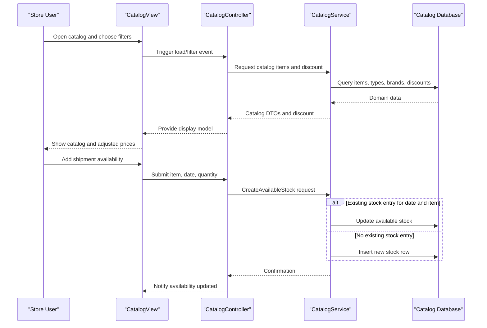

# Core Business Workflows

This document describes the main business flows in eShopLegacyNTier for catalog browsing, stock checks, and shipment availability updates.

## Domain Entities

| Entity | Service / Bounded Context | Description | Key Relationships |
|---|---|---|---|
| CatalogItem | Catalog Management (`eShopWCFService`) | Sellable product in storefront catalog | Linked to `CatalogBrand`, `CatalogType`, and stock entries |
| CatalogBrand | Catalog Management | Brand grouping for product filtering | One brand maps to many catalog items |
| CatalogType | Catalog Management | Type/category grouping for product filtering | One type maps to many catalog items |
| CatalogItemsStock | Inventory Availability | Per-date stock availability for a catalog item | Many stock records per catalog item |
| DiscountItem | Promotions | Time-bounded discount policy used in pricing display | Applied to catalog prices during active date range |

## Service-to-Domain Mapping

| Service | Domain Context | Owned Entities | External Dependencies |
|---|---|---|---|
| eShopWCFService | Catalog, Inventory, Promotions | CatalogItem, CatalogBrand, CatalogType, CatalogItemsStock, DiscountItem | SQL Server LocalDB via EF6 |
| eShopWinForms | Sales UI | None (reads/writes via service contracts) | WCF endpoint `CatalogService.svc` |

## Primary Workflows

### Workflow 1: Browse Catalog with Active Discount

1. Store user opens WinForms catalog screen.
2. `CatalogController.LoadView()` requests catalog items, brand filters, and type filters from WCF service.
3. Service queries catalog entities and active discount window.
4. UI computes discounted display price and renders products.

### Workflow 2: Check Stock Availability by Date

1. User selects product and date in stock search UI.
2. Controller invokes `GetAvailableStock(date, itemId)`.
3. Service queries stock records and returns quantity (or zero when missing).
4. UI appends the result to availability list for user decision making.

### Workflow 3: Record Incoming Shipment Availability

1. User enters product id, quantity, and arrival date.
2. Controller builds `CatalogItemsStock` request and calls `CreateAvailableStock`.
3. Service upserts stock for same date/item (update existing or insert new).
4. UI confirms update with message.

## Cross-Service Data Flows

The business flow is client-service oriented: the WinForms client orchestrates user interactions while the WCF service remains source of truth for catalog and inventory data. Data composition happens in the client view model (catalog items + discount value). No multi-backend aggregation or asynchronous fallback path is implemented.

## Business Workflow Sequence

## Business Rules & Decision Logic

- Brand/type filter value `0` means "All" and bypasses that filter in catalog query logic.
- Discount applies only when current date falls within configured `Start` and `End` date range.
- Stock update uses upsert-style behavior by item and date.
- Missing stock entry for selected date is treated as zero availability.
