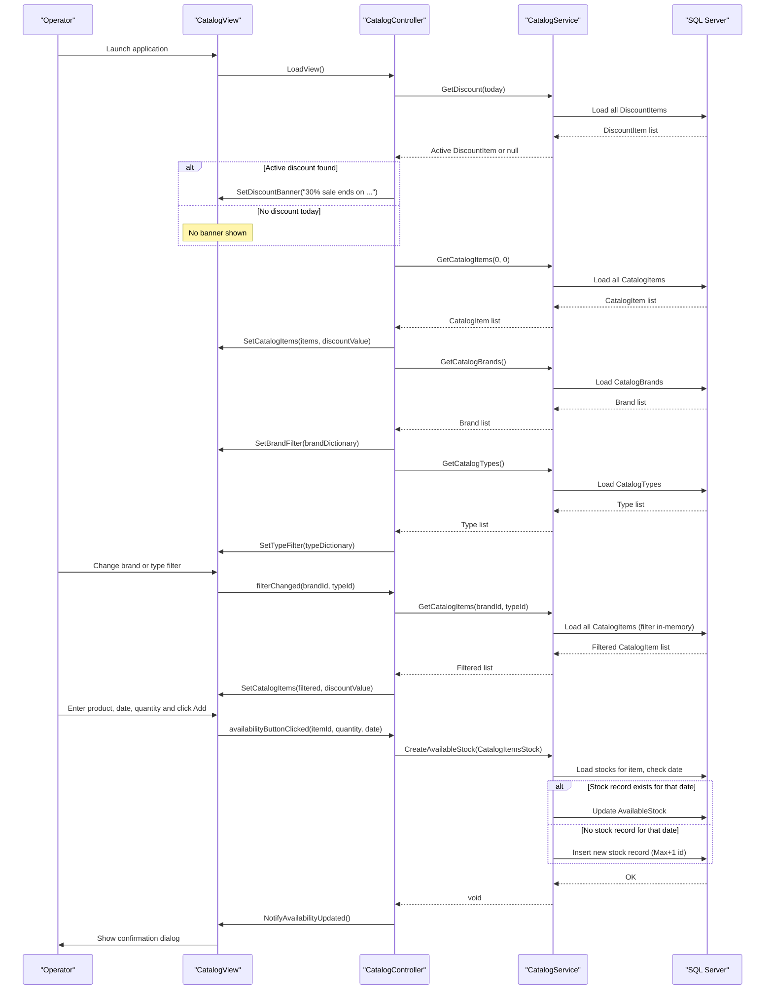

# Core Business Workflows

eShopLegacyNTier is a product catalog management application that allows operators to browse catalog items with brand/type filtering, view time-limited promotional discounts, and manage stock availability (incoming shipments) for individual products.

## Domain Entities

| Entity | Service / Bounded Context | Description | Key Relationships |
|---|---|---|---|
| CatalogItem | Catalog Management (eShopWCFService) | A product in the catalog with name, description, price, and image | Belongs to one CatalogBrand and one CatalogType; has many CatalogItemsStock records |
| CatalogBrand | Catalog Management (eShopWCFService) | A brand label for grouping catalog items (e.g., ".NET", "Azure") | Groups many CatalogItems |
| CatalogType | Catalog Management (eShopWCFService) | A product category/type (e.g., "T-Shirt", "Mug") | Groups many CatalogItems |
| CatalogItemsStock | Inventory Management (eShopWCFService) | A stock availability record for a specific product on a specific date | Belongs to one CatalogItem |
| DiscountItem | Promotions Management (eShopWCFService) | A time-bounded promotional discount (percentage) applied globally to all catalog items | Independent entity — no FK to CatalogItem |

## Service-to-Domain Mapping

| Service | Domain Context | Owned Entities | External Dependencies |
|---|---|---|---|
| eShopWCFService | Catalog Management, Inventory Management, Promotions Management | CatalogItem, CatalogBrand, CatalogType, CatalogItemsStock, DiscountItem | SQL Server database (via EF6) |
| eShopWinForms | Presentation / UI | None (consumer only) | eShopWCFService (via WCF SOAP proxy) |

All business logic and data ownership reside in `eShopWCFService`. The WinForms client is a pure consumer — it does not own any domain entities and delegates all operations to the service. There are no cross-service data access concerns since there is a single backend service.

## Primary Workflows

### Workflow 1: Browse Catalog with Filter and Discount

**Trigger:** User launches the WinForms application.

**Steps:**
1. Application initialises and calls `CatalogController.LoadView()`.
2. Controller checks for an active discount by calling `GetDiscount(DateTime.Now)`.
   - Service loads all `DiscountItem` records and finds one whose `Start.Date <= today <= End.Date`.
   - If a discount is active, the view displays a promotional banner (e.g., "30% sale ends on 21/09/2017!").
3. Controller loads all catalog items by calling `GetCatalogItems(0, 0)` (no filter).
   - Service loads all `CatalogItem` records and returns them.
   - If an active discount exists, the controller applies it: `displayPrice = price × (1 − discountSize)`.
   - View renders items in a data grid with thumbnail image, ID, name, description, and discounted price.
4. Controller loads brand and type filters by calling `GetCatalogBrands()` and `GetCatalogTypes()`.
   - Service returns all `CatalogBrand` and `CatalogType` records.
   - View populates brand and type dropdown menus, prefixing each with an "All" option (id=0).
5. Controller loads all items for the shipment panel by calling `GetCatalogItems(0, 0)` again.
   - View populates the shipment list box and product ID dropdown.

**Business rules applied:**
- Active discount check: `Start.Date <= today <= End.Date` (date comparison, time component ignored).
- Discount applied to display price: `price × (1 − discountSize)`. The discounted price is display-only; the stored price is not mutated.
- Filter "All" represented by id=0; the service treats `brandIdFilter == 0` or `typeIdFilter == 0` as "no filter applied".

---

### Workflow 2: Filter Catalog by Brand and/or Type

**Trigger:** User changes the brand or type dropdown selection in the UI.

**Steps:**
1. View fires a `filterChanged` event carrying the selected brand id and type id.
2. `CatalogController` handles the event and calls `GetCatalogItems(brandId, typeId)`.
3. Service loads all `CatalogItem` records into memory and applies in-process LINQ filtering:
   - Items where `CatalogBrandId == brandId` (if brandId != 0)
   - AND `CatalogTypeId == typeId` (if typeId != 0)
4. Controller also fetches the active discount (same logic as Workflow 1) and applies it to display prices.
5. View clears the grid and re-renders the filtered result set.

**Business rules applied:**
- When both filters are 0, all items are returned (equivalent to no filter).
- Discount applies to all returned items regardless of filter.

---

### Workflow 3: Record Stock Availability (Shipment)

**Trigger:** User selects a product, enters a date and quantity, and clicks "Add Availability".

**Steps:**
1. View validates that a product ID, quantity, and arrival date have been entered (null/empty guard — no submission if any field is missing).
2. View fires an `availabilityButtonClicked` event with the product id, quantity, and ship date.
3. `CatalogController` creates a `CatalogItemsStock` object and calls `CreateAvailableStock(stock)`.
4. Service performs an upsert:
   - Loads all `CatalogItemsStock` records for the given `CatalogItemId` into memory.
   - Checks if a record already exists for the same date (date-only comparison).
   - **If exists:** Updates `AvailableStock` on the existing record (marks as `Modified`, saves).
   - **If not exists:** Assigns a new `StockId` using `Max(StockId) + 1`, inserts the new record, saves.
5. View resets the input fields and shows a confirmation dialog ("Shipment has been added to the database.").

**Business rules applied:**
- Upsert semantics: one stock record per item per date; subsequent entries for the same item+date overwrite the previous value.
- `StockId` is application-assigned (`Max + 1`), not database-generated — no auto-increment.
- UI pre-condition: product ID, quantity, and date must all be non-empty before submission.

---

### Workflow 4: Query Stock Availability

**Trigger:** User selects a product from the shipment list box, picks a date on the calendar, and clicks "Search Availability".

**Steps:**
1. View parses the selected item from the list box to extract the product ID.
2. View fires a `searchStockButtonClicked` event with the product ID and selected date.
3. `CatalogController` calls `GetAvailableStock(date, catalogItemId)`.
4. Service loads all `CatalogItemsStock` records for the item and finds the one matching the exact date (date-only comparison).
   - Returns the `AvailableStock` count, or 0 if no record exists for that date.
5. View appends a new row to the results list view showing date, item ID, and availability count.

**Business rules applied:**
- If no stock record exists for the given item and date, availability is 0 (not an error).
- Date comparison is date-only (time component stripped via `.Date`).

## Cross-Service Data Flows

This application has a single backend service (`eShopWCFService`) and a single client (`eShopWinForms`). All data flows are synchronous request/response over SOAP (WCF basicHttpBinding). There are no cross-service aggregation patterns, no parallel calls, no event-driven flows, and no circuit breakers.

The only composite data assembly happens within `CatalogController.LoadCatalogItems()`, which calls `GetCatalogItems` and `GetDiscount` sequentially and merges the discount into the display price client-side. This is not a cross-service aggregation — both calls go to the same WCF service.

If the WCF service is unreachable, the WinForms client has no fallback — the application will throw an unhandled exception on startup.

## Business Workflow Sequence

## Business Rules & Decision Logic

### Validation Rules

- **Stock entry pre-condition (UI):** Product ID, quantity, and arrival date must all be non-empty before `CreateAvailableStock` is invoked. If any field is missing, the operation is silently aborted (no error message to the user).
- **Stock date uniqueness per item:** Only one stock record is allowed per `(CatalogItemId, Date)` pair. Duplicate entries overwrite the existing record.

### Decision Logic

- **Discount application:** `GetDiscount(today)` loads all discount records and returns the first whose date range includes today. If multiple records overlap, the first match (by LINQ evaluation order) wins. The discount is a global percentage (0.0–1.0) applied to all items' display prices.
- **Filter behaviour:** A filter value of `0` means "no filter" (show all). Both brand and type filters can be active simultaneously (AND logic). The entire `CatalogItems` table is loaded into memory before filtering.
- **Stock upsert:** The upsert is implemented manually (no EF `AddOrUpdate`). The application loads all stock for the item, finds a date match in-process, and then either updates or inserts.

### Business Constraints

- **Application-managed IDs:** `CatalogItem.Id`, `CatalogBrand.Id`, `CatalogType.Id`, `CatalogItemsStock.StockId`, and `DiscountItem.Id` are all assigned by the application using `Max(id) + 1`. This is not concurrency-safe — concurrent inserts can produce duplicate IDs.
- **Discount dates are hardcoded seeds:** Discount records in the preconfigured seed data reference specific dates in 2017. The application does not include any UI for creating or editing discounts.
- **Image files must exist locally:** `CatalogView.SetCatalogItems` constructs a local file path for each item's image (`Assets\Images\Catalog\{Picturefilename}`) and calls `Image.FromFile()`. If the file is missing, an unhandled exception is thrown.

### Transactions

No explicit `TransactionScope` or EF transaction management is used. Each `SaveChanges()` call is its own implicit transaction. There are no multi-step operations that are wrapped in a single transaction, and no saga or compensating transaction patterns.

### Error Handling

No structured business exception types are defined. Errors surface as unhandled .NET exceptions (e.g., `CommunicationException` if WCF is unavailable, `InvalidOperationException` if the max ID query runs on an empty table). There is no retry logic, no dead-letter handling, and no user-facing error messages beyond the modal dialog for stock confirmation.

### Authorization

No authentication or authorization is implemented. Any user who can launch the WinForms application has full read and write access to all catalog management operations.
