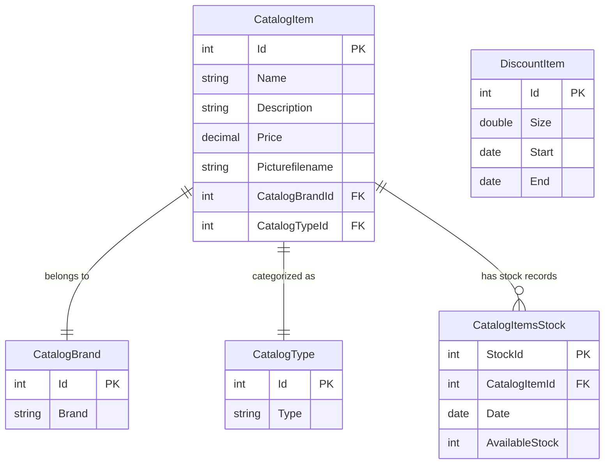

# Data Architecture & Persistence Layer

The data layer consists of five EF6 entities owned exclusively by the `eShopWCFService` project, all persisted to a single SQL Server (LocalDB) database via Entity Framework 6 Code-First with no migration tooling.

## Database Configuration

| Service/Module | DB Type | Profile | Driver | Connection | Migration Tool |
|---|---|---|---|---|---|
| eShopWCFService | SQL Server (LocalDB / MSSQLLocalDB) | Default (single profile) | System.Data.SqlClient (EF6 SqlServer provider) | `(localdb)\MSSQLLocalDB; Initial Catalog=eShopDatabase` or overridden via `ConnectionString` environment variable | None — uses `CreateDatabaseIfNotExists` initializer with programmatic seed data |

Schema creation is handled by EF6's `CreateDatabaseIfNotExists` database initializer (`CatalogDBInitializer`), which creates the schema on first run and seeds catalog types, brands, items, stock, and discount records. There are no Flyway/Liquibase/EF Migrations scripts — schema versioning is not supported. The connection string can be overridden at runtime via the `ConnectionString` environment variable. For all property keys and values, see `configuration-inventory.md`.

## Data Ownership per Service

| Service | Tables Owned | ORM Framework | Caching | Notes |
|---|---|---|---|---|
| eShopWCFService | CatalogItems, CatalogBrands, CatalogTypes, CatalogItemsStock, DiscountItems | Entity Framework 6.1.3 (Code-First) | None | Single DbContext (`EntityModel`); no repository pattern — service calls DbContext directly |
| eShopWinForms | None | N/A (consumes WCF service) | None | Client only; all data access delegated to WCF service |

## Entity Model

**Entity notes:**

- `CatalogItem.Id`, `CatalogBrand.Id`, `CatalogType.Id`, `CatalogItemsStock.StockId` are all `DatabaseGeneratedOption.None` — the application is responsible for assigning IDs (using `Max(id) + 1` in the service methods).
- `CatalogItem.Price` is mapped as SQL `money` type.
- `CatalogItemsStock.Date` and `DiscountItem.Start`/`End` are mapped as SQL `date` (date-only, no time component).
- `CatalogBrand.Brand` is mapped as non-Unicode (`varchar`) with `StringLength(50)`.
- `DiscountItem` has no foreign key to `CatalogItem` — discounts are global (apply to all items in the catalog for a given date range).
- No navigation properties are defined on `CatalogItemsStock` or `DiscountItem` (no back-references to `CatalogItem`).

## Key Repository Methods

There are no dedicated repository interfaces in this project. The `CatalogService` class accesses the `EntityModel` DbContext directly. The `CatalogServiceMock` provides an in-memory equivalent.

| Service | Class | Notable Methods | Purpose |
|---|---|---|---|
| eShopWCFService | CatalogService | `GetCatalogItems(int brandIdFilter, int typeIdFilter)` | Returns all CatalogItems matching optional brand and type filters; loads full list into memory then filters in-process |
| eShopWCFService | CatalogService | `FindCatalogItem(int id)` | Finds a CatalogItem by ID and eagerly loads its CatalogBrand and CatalogType in separate queries |
| eShopWCFService | CatalogService | `GetAvailableStock(DateTime date, int catalogItemId)` | Loads all stock records for an item into memory then filters by date in-process |
| eShopWCFService | CatalogService | `CreateAvailableStock(CatalogItemsStock)` | Upserts a stock record — updates if one exists for the same item and date, otherwise inserts |
| eShopWCFService | CatalogService | `GetDiscount(DateTime day)` | Loads all discount records into memory then filters by date range in-process |

> Note: All filtering in `GetCatalogItems`, `GetAvailableStock`, and `GetDiscount` uses `.ToList()` before applying LINQ predicates, meaning the full table is loaded into memory on every call. This is a performance concern that should be addressed during modernization.

## Caching Strategy

No caching layer is implemented in either project. All data is read directly from SQL Server on every service call with no result caching, output caching, or in-memory cache. There is no Redis, MemoryCache, IDistributedCache, or second-level EF cache configured.

## Data Ownership Boundaries

The application uses a **single shared database** (`eShopDatabase`) owned entirely by `eShopWCFService`. The `eShopWinForms` client has no direct database access — all data operations are delegated through the WCF service layer. There is no database-per-service pattern, no logical schema separation, and no cross-service data access concerns since there is only one service owning data.

Read/write patterns are synchronous and direct: the WCF service reads from and writes to SQL Server in-band with the client request. There is no CQRS separation, no read replicas, and no event sourcing.

### Data Classification & Sensitivity

| Entity | Sensitive Fields | Classification | Controls in Place |
|---|---|---|---|
| CatalogItem | None (product catalog: name, description, price, image filename) | None | N/A |
| CatalogBrand | None (brand name) | None | N/A |
| CatalogType | None (category name) | None | N/A |
| CatalogItemsStock | None (stock quantities and dates) | None | N/A |
| DiscountItem | None (discount size and date range) | None | N/A |

No PII, PHI, or PCI data was detected in the entity model. The application manages product catalog and inventory data only. No customer names, addresses, payment card data, or health information are stored.
