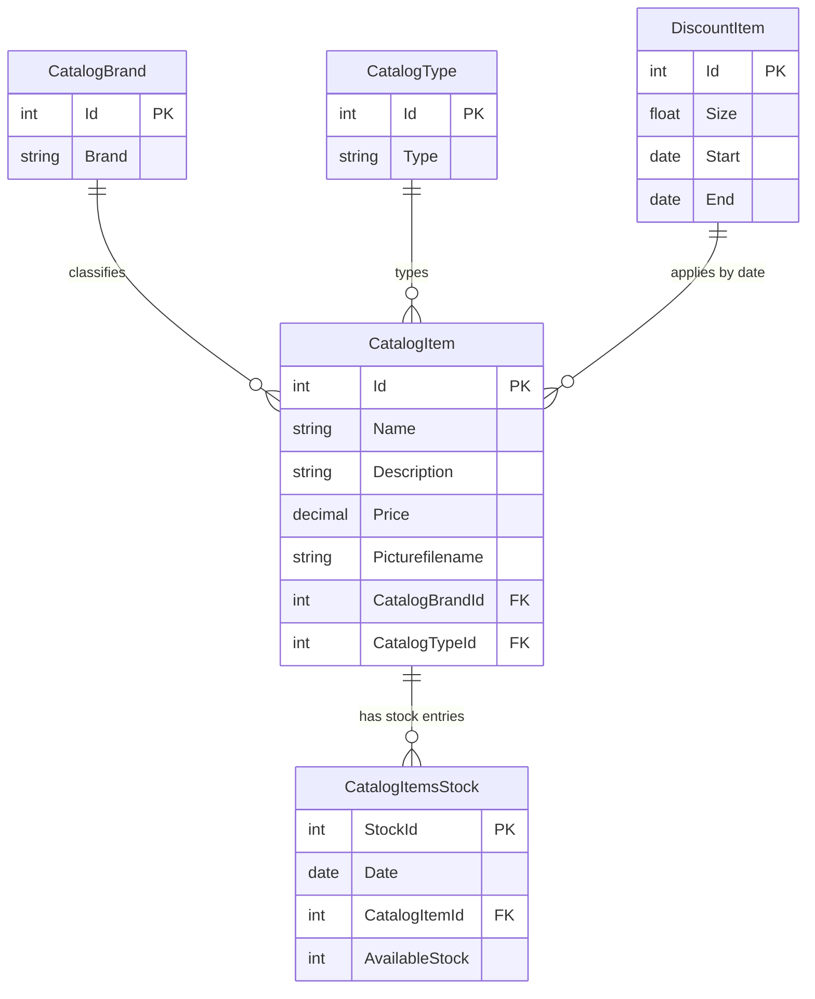

# Data Architecture & Persistence Layer

This document summarizes the persistence model for the eShopLegacyNTier service data layer and catalog domain entities.

## Database Configuration

| Service/Module | DB Type | Profile | Driver | Connection | Migration Tool |
|---|---|---|---|---|---|
| eShopWCFService | SQL Server LocalDB | Default | System.Data.SqlClient via EF6 provider | `EntityModel` connection string to `(localdb)\MSSQLLocalDB;Initial Catalog=eShopDatabase` (or `ConnectionString` env var override) | EF6 initializer (`CreateDatabaseIfNotExists`) |

## Data Ownership per Service

| Service | Tables Owned | ORM Framework | Caching | Notes |
|---|---|---|---|---|
| eShopWCFService | CatalogItem, CatalogBrand, CatalogType, CatalogItemsStock, DiscountItem | Entity Framework 6 | None detected | Single service owns and seeds all catalog-related entities |
| eShopWinForms | None | N/A | None | Consumes data through WCF service only |

## Entity Model

## Key Repository Methods

| Service | Repository | Notable Methods | Purpose |
|---|---|---|---|
| eShopWCFService | EntityModel DbContext (`EntityModel.cs`) | `CatalogItems.Where(...)`, `CatalogBrands.ToList()`, `CatalogTypes.ToList()` | Query catalog items and filter metadata |
| eShopWCFService | CatalogService | `GetAvailableStock(date, itemId)` | Reads stock for a specific item/date |
| eShopWCFService | CatalogService | `CreateAvailableStock(CatalogItemsStock)` | Upserts stock entry for a specific date |
| eShopWCFService | CatalogService | `GetDiscount(day)` | Retrieves active discount window for current date |

## Caching Strategy

No explicit cache provider or cache-aside/read-through strategy is configured. All reads and writes are served directly through EF6 DbContext calls against SQL Server LocalDB.

## Data Ownership Boundaries

The solution uses a single shared database accessed only by the WCF service. The WinForms module does not access the database directly and relies on service operations for reads/writes. This establishes a clear service boundary with centralized persistence ownership in `eShopWCFService`.

### Data Classification & Sensitivity

| Entity | Sensitive Fields | Classification (PII/PHI/PCI/None) | Controls in Place |
|---|---|---|---|
| CatalogItem | None detected | None | N/A |
| CatalogBrand | None detected | None | N/A |
| CatalogType | None detected | None | N/A |
| CatalogItemsStock | None detected | None | N/A |
| DiscountItem | None detected | None | N/A |

No PII, PHI, or PCI data detected in the current entity model.
