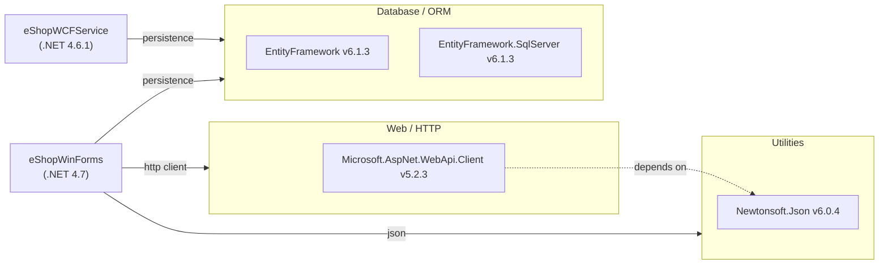

# Dependency Map

This document maps all external dependencies for eShopLegacyNTier, a two-project .NET Framework solution. A total of 3 unique external packages are declared across both projects.

## Dependencies

### Dependency Summary

| Category | Count | Key Libraries | Notes |
|---|---|---|---|
| Database / ORM | 2 | EntityFramework 6.1.3, EntityFramework.SqlServer 6.1.3 | Legacy EF6 targeting .NET Framework only |
| Web / HTTP | 1 | Microsoft.AspNet.WebApi.Client 5.2.3 | Legacy ASP.NET Web API client for .NET Framework |
| Utilities | 1 | Newtonsoft.Json 6.0.4 | Pulled in as transitive dependency of WebApi.Client |

### Version & Compatibility Risks

All declared packages are significantly outdated. **Entity Framework 6.1.3** was released in 2014; while EF6 has a supported .NET Core port (EF6 for .NET), migration to EF Core is recommended for cloud readiness. **Microsoft.AspNet.WebApi.Client 5.2.3** targets the legacy `System.Net.Http` from .NET Framework and has no direct equivalent in .NET Core/5+; replacement with `System.Net.Http.HttpClient` or `Microsoft.AspNet.WebApi.Client` updated for .NET Standard is required. **Newtonsoft.Json 6.0.4** dates from 2014 and contains known vulnerabilities and behavioral differences compared to the current 13.x release; `System.Text.Json` (built into modern .NET) is the recommended modern alternative. Both projects target legacy .NET Framework versions (4.6.1 and 4.7) which are in maintenance-only mode.

### Notable Observations

- **WCF is not a NuGet package**: The service layer is built on `System.ServiceModel` (WCF), which is a .NET Framework built-in assembly, not a NuGet package. WCF client support exists in .NET via the `System.ServiceModel.*` NuGet packages, but the WCF server-side hosting model is not supported on .NET Core/.NET 5+.
- **No logging framework**: Neither project declares a logging library (e.g., Serilog, NLog, log4net). All diagnostic output relies on unstructured debugging or is absent, which is a gap for cloud-native observability.
- **No security or identity library**: There is no authentication, authorization, or token library declared. The WCF service uses no message-level security configuration visible in packages.
- **Minimal dependency footprint**: The application has a very small explicit dependency surface (3 packages), which simplifies migration but also highlights the heavy reliance on built-in .NET Framework BCL types (WCF, Windows Forms, System.Data) that have no direct equivalents on modern .NET.

## Test Dependencies

No test projects were detected in this solution. There are no test frameworks, mocking libraries, or assertion libraries declared.

Total test-scope dependencies: 0

No testing infrastructure is present. This is a significant gap for modernization — adding unit and integration tests before migration is strongly recommended to validate behavioral equivalence.
