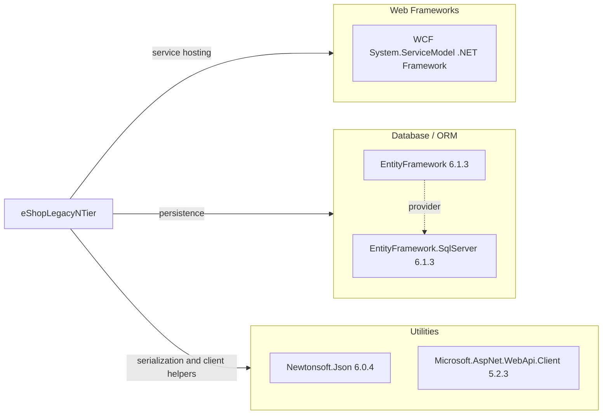

# Dependency Map

This map summarizes declared external dependencies for eShopLegacyNTier from project package declarations.

## Dependencies

### Dependency Summary

| Category | Count | Key Libraries | Notes |
|---|---:|---|---|
| Web Frameworks | 1 | WCF/System.ServiceModel | SOAP service exposure for catalog operations |
| Database / ORM | 2 | EntityFramework 6.1.3, EntityFramework.SqlServer 6.1.3 | Legacy EF6 stack on .NET Framework |
| Utilities | 2 | Newtonsoft.Json 6.0.4, Microsoft.AspNet.WebApi.Client 5.2.3 | Older utility libraries for JSON and HTTP formatting |

### Version & Compatibility Risks

The dependency set is tied to .NET Framework-era libraries (EF6 and older Newtonsoft.Json/WebApi.Client versions). These versions can require migration effort when moving to modern .NET and may miss newer security and compatibility fixes.

### Notable Observations

- Both projects rely on packages.config-based dependency management.
- Dependency graph is compact, with most functionality in framework assemblies.
- No dedicated observability, messaging, or caching libraries are declared.
- No separate test package dependencies were detected.

## Test Dependencies

| Framework | Version | Notes |
|---|---|---|
| None detected | N/A | No test-scoped package declarations found in packages.config files |

Total test-scope dependencies: 0
No test dependency declarations were found in project package files.
