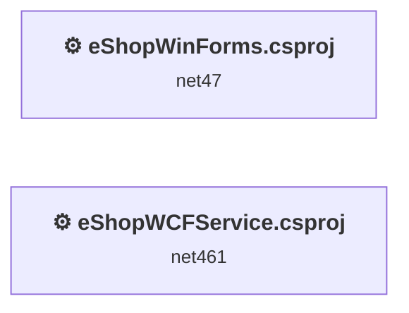
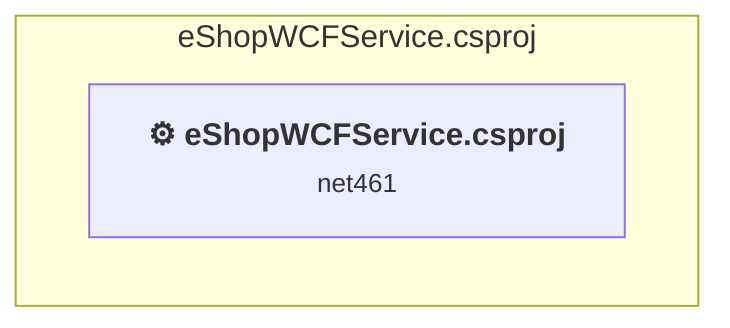
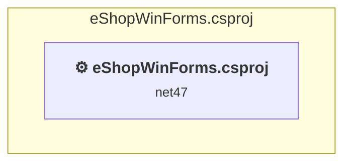

# Projects and dependencies analysis

This document provides a comprehensive overview of the projects and their dependencies in the context of upgrading to .NETCoreApp,Version=v10.0.

## Table of Contents

- [Executive Summary](#executive-Summary)
  - [Highlevel Metrics](#highlevel-metrics)
  - [Projects Compatibility](#projects-compatibility)
  - [Package Compatibility](#package-compatibility)
  - [API Compatibility](#api-compatibility)
  - [Binding Redirect Configuration](#binding-redirect-configuration)
- [Aggregate NuGet packages details](#aggregate-nuget-packages-details)
- [Top API Migration Challenges](#top-api-migration-challenges)
  - [Technologies and Features](#technologies-and-features)
  - [Most Frequent API Issues](#most-frequent-api-issues)
- [Projects Relationship Graph](#projects-relationship-graph)
- [Project Details](#project-details)

  - [src\eShopWCFService\eShopWCFService.csproj](#srceshopwcfserviceeshopwcfservicecsproj)
  - [src\eShopWinForms\eShopWinForms.csproj](#srceshopwinformseshopwinformscsproj)

## Executive Summary

### Highlevel Metrics

| Metric | Count | Status |
| :--- | :---: | :--- |
| Total Projects | 2 | All require upgrade |
| Total NuGet Packages | 3 | All packages need upgrade |
| Total Code Files | 22 |  |
| Total Code Files with Incidents | 9 |  |
| Total Lines of Code | 2800 |  |
| Total Number of Issues | 1773 |  |
| Estimated LOC to modify | 1762+ | at least 62.9% of codebase |

### Projects Compatibility

| Project | Target Framework | Difficulty | Package Issues | API Issues | Binding Issues | Est. LOC Impact | Description |
| :--- | :---: | :---: | :---: | :---: | :---: | :---: | :--- |
| [src\eShopWCFService\eShopWCFService.csproj](#srceshopwcfserviceeshopwcfservicecsproj) | net461 | 🔴 High | 2 | 22 | 0 | 22+ | Wap, Sdk Style = False |
| [src\eShopWinForms\eShopWinForms.csproj](#srceshopwinformseshopwinformscsproj) | net47 | 🟡 Medium | 5 | 1740 | 0 | 1740+ | ClassicWinForms, Sdk Style = False |

### Package Compatibility

| Status | Count | Percentage |
| :--- | :---: | :---: |
| ✅ Compatible | 0 | 0.0% |
| ⚠️ Incompatible | 1 | 33.3% |
| 🔄 Upgrade Recommended | 2 | 66.7% |
| ***Total NuGet Packages*** | ***3*** | ***100%*** |

### API Compatibility

| Category | Count | Impact |
| :--- | :---: | :--- |
| 🔴 Binary Incompatible | 1644 | High - Require code changes |
| 🟡 Source Incompatible | 118 | Medium - Needs re-compilation and potential conflicting API error fixing |
| 🔵 Behavioral change | 0 | Low - Behavioral changes that may require testing at runtime |
| ✅ Compatible | 2656 |  |
| ***Total APIs Analyzed*** | ***4418*** |  |

## Aggregate NuGet packages details

| Package | Current Version | Suggested Version | Projects | Description |
| :--- | :---: | :---: | :--- | :--- |
| EntityFramework | 6.1.3 | 6.5.2 | [eShopWCFService.csproj](#srceshopwcfserviceeshopwcfservicecsproj) [eShopWinForms.csproj](#srceshopwinformseshopwinformscsproj) | NuGet package upgrade is recommended |
| Microsoft.AspNet.WebApi.Client | 5.2.3 | 6.0.0 | [eShopWinForms.csproj](#srceshopwinformseshopwinformscsproj) | ⚠️NuGet package is incompatible |
| Newtonsoft.Json | 6.0.4 | 13.0.4 | [eShopWinForms.csproj](#srceshopwinformseshopwinformscsproj) | NuGet package upgrade is recommended |

## Top API Migration Challenges

### Technologies and Features

| Technology | Issues | Percentage | Migration Path |
| :--- | :---: | :---: | :--- |
| Windows Forms | 1644 | 93.3% | Windows Forms APIs for building Windows desktop applications with traditional Forms-based UI that are available in .NET on Windows. Enable Windows Desktop support: Option 1 (Recommended): Target net9.0-windows; Option 2: Add <UseWindowsDesktop>true</UseWindowsDesktop>; Option 3 (Legacy): Use Microsoft.NET.Sdk.WindowsDesktop SDK. |
| Windows Forms Legacy Controls | 126 | 7.2% | Legacy Windows Forms controls that have been removed from .NET Core/5+ including StatusBar, DataGrid, ContextMenu, MainMenu, MenuItem, and ToolBar. These controls were replaced by more modern alternatives. Use ToolStrip, MenuStrip, ContextMenuStrip, and DataGridView instead. |
| GDI+ / System.Drawing | 87 | 4.9% | System.Drawing APIs for 2D graphics, imaging, and printing that are available via NuGet package System.Drawing.Common. Note: Not recommended for server scenarios due to Windows dependencies; consider cross-platform alternatives like SkiaSharp or ImageSharp for new code. |
| WCF Client APIs | 29 | 1.6% | WCF client-side APIs for building service clients that communicate with WCF services. These APIs are available as exact equivalents via NuGet packages - add System.ServiceModel.* NuGet packages (System.ServiceModel.Http, System.ServiceModel.Primitives, System.ServiceModel.NetTcp, etc.) |
| Legacy Configuration System | 2 | 0.1% | Legacy XML-based configuration system (app.config/web.config) that has been replaced by a more flexible configuration model in .NET Core. The old system was rigid and XML-based. Migrate to Microsoft.Extensions.Configuration with JSON/environment variables; use System.Configuration.ConfigurationManager NuGet package as interim bridge if needed. |

### Most Frequent API Issues

| API | Count | Percentage | Category |
| :--- | :---: | :---: | :--- |
| T:System.Windows.Forms.TableLayoutPanel | 129 | 7.3% | Binary Incompatible |
| T:System.Windows.Forms.SizeType | 88 | 5.0% | Binary Incompatible |
| T:System.Windows.Forms.Label | 67 | 3.8% | Binary Incompatible |
| T:System.Windows.Forms.ComboBox | 53 | 3.0% | Binary Incompatible |
| T:System.Windows.Forms.GroupBox | 52 | 3.0% | Binary Incompatible |
| T:System.Windows.Forms.Padding | 50 | 2.8% | Binary Incompatible |
| T:System.Drawing.Bitmap | 45 | 2.6% | Source Incompatible |
| T:System.Windows.Forms.AnchorStyles | 44 | 2.5% | Binary Incompatible |
| T:System.Windows.Forms.PictureBox | 42 | 2.4% | Binary Incompatible |
| T:System.Windows.Forms.DataGridViewTextBoxColumn | 37 | 2.1% | Binary Incompatible |
| T:System.Windows.Forms.RowStyle | 34 | 1.9% | Binary Incompatible |
| M:System.Windows.Forms.RowStyle.#ctor(System.Windows.Forms.SizeType,System.Single) | 34 | 1.9% | Binary Incompatible |
| T:System.Windows.Forms.TableLayoutRowStyleCollection | 34 | 1.9% | Binary Incompatible |
| P:System.Windows.Forms.TableLayoutPanel.RowStyles | 34 | 1.9% | Binary Incompatible |
| M:System.Windows.Forms.TableLayoutRowStyleCollection.Add(System.Windows.Forms.RowStyle) | 34 | 1.9% | Binary Incompatible |
| P:System.Windows.Forms.Control.Name | 32 | 1.8% | Binary Incompatible |
| T:System.Windows.Forms.TabPage | 31 | 1.8% | Binary Incompatible |
| P:System.Windows.Forms.Control.Size | 30 | 1.7% | Binary Incompatible |
| P:System.Windows.Forms.Control.Location | 29 | 1.6% | Binary Incompatible |
| F:System.Windows.Forms.SizeType.Absolute | 28 | 1.6% | Binary Incompatible |
| T:System.Windows.Forms.BindingSource | 27 | 1.5% | Binary Incompatible |
| P:System.Windows.Forms.Control.TabIndex | 26 | 1.5% | Binary Incompatible |
| T:System.Windows.Forms.Button | 23 | 1.3% | Binary Incompatible |
| T:System.Windows.Forms.TextBox | 22 | 1.2% | Binary Incompatible |
| M:System.Windows.Forms.Padding.#ctor(System.Int32) | 22 | 1.2% | Binary Incompatible |
| T:System.Windows.Forms.DataGridView | 21 | 1.2% | Binary Incompatible |
| P:System.Windows.Forms.Control.Margin | 20 | 1.1% | Binary Incompatible |
| T:System.Windows.Forms.ColumnHeader | 18 | 1.0% | Binary Incompatible |
| T:System.Windows.Forms.ListView | 18 | 1.0% | Binary Incompatible |
| T:System.Windows.Forms.TabControl | 17 | 1.0% | Binary Incompatible |
| F:System.Windows.Forms.SizeType.Percent | 16 | 0.9% | Binary Incompatible |
| T:System.Windows.Forms.TableLayoutControlCollection | 16 | 0.9% | Binary Incompatible |
| P:System.Windows.Forms.TableLayoutPanel.Controls | 16 | 0.9% | Binary Incompatible |
| M:System.Windows.Forms.TableLayoutControlCollection.Add(System.Windows.Forms.Control,System.Int32,System.Int32) | 16 | 0.9% | Binary Incompatible |
| T:System.Windows.Forms.Control.ControlCollection | 15 | 0.9% | Binary Incompatible |
| P:System.Windows.Forms.Control.Controls | 15 | 0.9% | Binary Incompatible |
| M:System.Windows.Forms.Control.ControlCollection.Add(System.Windows.Forms.Control) | 15 | 0.9% | Binary Incompatible |
| T:System.Windows.Forms.ListBox | 13 | 0.7% | Binary Incompatible |
| M:System.Windows.Forms.Control.ResumeLayout(System.Boolean) | 12 | 0.7% | Binary Incompatible |
| M:System.Windows.Forms.Control.SuspendLayout | 12 | 0.7% | Binary Incompatible |
| T:System.Windows.Forms.MonthCalendar | 11 | 0.6% | Binary Incompatible |
| M:System.ServiceModel.OperationContractAttribute.#ctor | 10 | 0.6% | Source Incompatible |
| T:System.ServiceModel.OperationContractAttribute | 10 | 0.6% | Source Incompatible |
| T:System.Windows.Forms.ColumnStyle | 10 | 0.6% | Binary Incompatible |
| M:System.Windows.Forms.ColumnStyle.#ctor(System.Windows.Forms.SizeType,System.Single) | 10 | 0.6% | Binary Incompatible |
| T:System.Windows.Forms.TableLayoutColumnStyleCollection | 10 | 0.6% | Binary Incompatible |
| P:System.Windows.Forms.TableLayoutPanel.ColumnStyles | 10 | 0.6% | Binary Incompatible |
| M:System.Windows.Forms.TableLayoutColumnStyleCollection.Add(System.Windows.Forms.ColumnStyle) | 10 | 0.6% | Binary Incompatible |
| P:System.Windows.Forms.ComboBox.SelectedItem | 10 | 0.6% | Binary Incompatible |
| T:System.Windows.Forms.DataGridViewImageColumn | 9 | 0.5% | Binary Incompatible |

## Projects Relationship Graph

Legend:
📦 SDK-style project
⚙️ Classic project

## Project Details

### src\eShopWCFService\eShopWCFService.csproj

#### Project Info

- **Current Target Framework:** net461
- **Proposed Target Framework:** net10.0
- **SDK-style**: False
- **Project Kind:** Wap
- **Dependencies**: 0
- **Dependants**: 0
- **Number of Files**: 15
- **Number of Files with Incidents**: 2
- **Lines of Code**: 678
- **Estimated LOC to modify**: 22+ (at least 3.2% of the project)

#### Dependency Graph

Legend:
📦 SDK-style project
⚙️ Classic project

### API Compatibility

| Category | Count | Impact |
| :--- | :---: | :--- |
| 🔴 Binary Incompatible | 0 | High - Require code changes |
| 🟡 Source Incompatible | 22 | Medium - Needs re-compilation and potential conflicting API error fixing |
| 🔵 Behavioral change | 0 | Low - Behavioral changes that may require testing at runtime |
| ✅ Compatible | 1269 |  |
| ***Total APIs Analyzed*** | ***1291*** |  |

#### Project Technologies and Features

| Technology | Issues | Percentage | Migration Path |
| :--- | :---: | :---: | :--- |
| WCF Client APIs | 22 | 100.0% | WCF client-side APIs for building service clients that communicate with WCF services. These APIs are available as exact equivalents via NuGet packages - add System.ServiceModel.* NuGet packages (System.ServiceModel.Http, System.ServiceModel.Primitives, System.ServiceModel.NetTcp, etc.) |

### src\eShopWinForms\eShopWinForms.csproj

#### Project Info

- **Current Target Framework:** net47
- **Proposed Target Framework:** net10.0-windows
- **SDK-style**: False
- **Project Kind:** ClassicWinForms
- **Dependencies**: 0
- **Dependants**: 0
- **Number of Files**: 101
- **Number of Files with Incidents**: 7
- **Lines of Code**: 2122
- **Estimated LOC to modify**: 1740+ (at least 82.0% of the project)

#### Dependency Graph

Legend:
📦 SDK-style project
⚙️ Classic project

### API Compatibility

| Category | Count | Impact |
| :--- | :---: | :--- |
| 🔴 Binary Incompatible | 1644 | High - Require code changes |
| 🟡 Source Incompatible | 96 | Medium - Needs re-compilation and potential conflicting API error fixing |
| 🔵 Behavioral change | 0 | Low - Behavioral changes that may require testing at runtime |
| ✅ Compatible | 1387 |  |
| ***Total APIs Analyzed*** | ***3127*** |  |

#### Project Technologies and Features

| Technology | Issues | Percentage | Migration Path |
| :--- | :---: | :---: | :--- |
| Legacy Configuration System | 2 | 0.1% | Legacy XML-based configuration system (app.config/web.config) that has been replaced by a more flexible configuration model in .NET Core. The old system was rigid and XML-based. Migrate to Microsoft.Extensions.Configuration with JSON/environment variables; use System.Configuration.ConfigurationManager NuGet package as interim bridge if needed. |
| WCF Client APIs | 7 | 0.4% | WCF client-side APIs for building service clients that communicate with WCF services. These APIs are available as exact equivalents via NuGet packages - add System.ServiceModel.* NuGet packages (System.ServiceModel.Http, System.ServiceModel.Primitives, System.ServiceModel.NetTcp, etc.) |
| GDI+ / System.Drawing | 87 | 5.0% | System.Drawing APIs for 2D graphics, imaging, and printing that are available via NuGet package System.Drawing.Common. Note: Not recommended for server scenarios due to Windows dependencies; consider cross-platform alternatives like SkiaSharp or ImageSharp for new code. |
| Windows Forms Legacy Controls | 126 | 7.2% | Legacy Windows Forms controls that have been removed from .NET Core/5+ including StatusBar, DataGrid, ContextMenu, MainMenu, MenuItem, and ToolBar. These controls were replaced by more modern alternatives. Use ToolStrip, MenuStrip, ContextMenuStrip, and DataGridView instead. |
| Windows Forms | 1644 | 94.5% | Windows Forms APIs for building Windows desktop applications with traditional Forms-based UI that are available in .NET on Windows. Enable Windows Desktop support: Option 1 (Recommended): Target net9.0-windows; Option 2: Add <UseWindowsDesktop>true</UseWindowsDesktop>; Option 3 (Legacy): Use Microsoft.NET.Sdk.WindowsDesktop SDK. |

